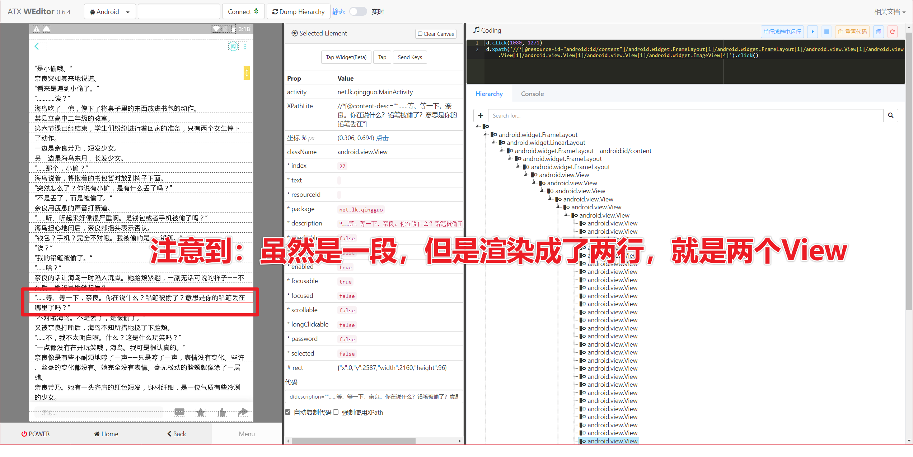
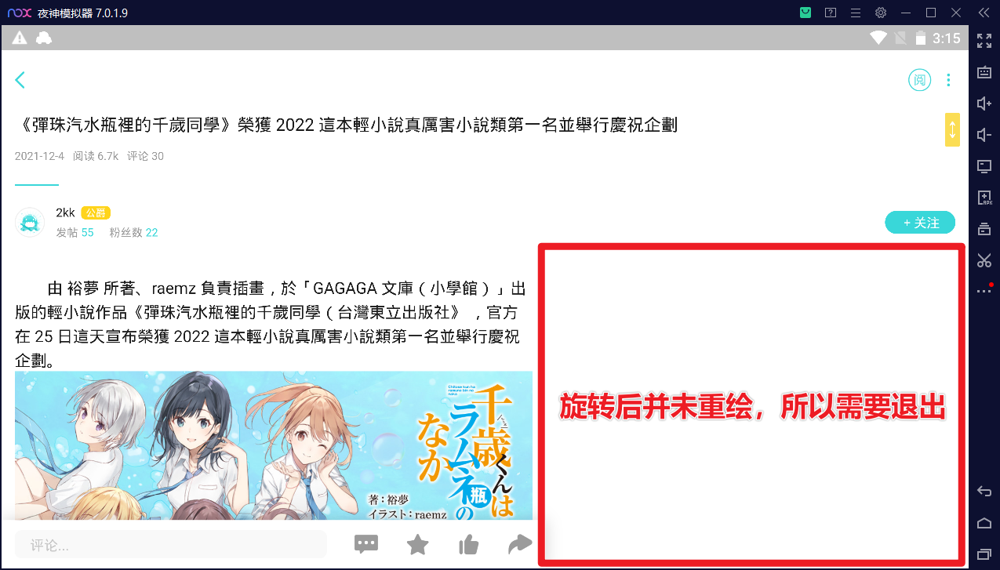

# lightnovel_epub

~~本工具用于基于[轻之国度](https://lightnovel.us)网页或 app 生成`epub`小说。~~

Update [2022/01/20]: **现已升级成为轻小说 epub 生成框架，支持更多网站**~~（当年名字取得好啊！）~~

**注意：本工具仅作学习交流使用，作者不对内容和使用情况付任何责任！**

~~本来就是一个面向过程的小工具，怎么越发繁琐起来了。。。这里还要感慨一下LK牛逼的防御技术~~

# 支持站点

| 站点 | 单网页 | 合集  | 移动端 |
| :--: | :---: | :---: | :---: |
| [轻之国度](https://www.lightnovel.us) | ✅ | ✅ | ✅ |
| [轻小说文库](https://www.wenku8.net/index.php) | ❌ | ✅ | ❔ |

# Requirements

* python 3.5 +
* click
* beautifulsoup4
* requests
* ebooklib
* uiautomator2
* dominate
* opencc
* opencv
* js2py

# `cli.py`

## 使用场景

针对可以在浏览器里阅读的文章。

* 2021/12/15 Update: 支持合集文章生成。
* 2021/12/15 Update: 支持 HTML 内嵌 base64 图片

## 原理

直接抓取 HTML，然后将其中的图片下载至本地，随后打包成 EPUB。

EPUB 内部目录：

```
.
├── Images               # 图片
│   ├── ...
│   └── ...
└── Text                 # 文本
    ├── about.xhtml      # 本项目自动生成
    └── lightnovel.xhtml # 轻小说正文
```

对于合集文章：

```
.
├── Images               # 图片
│   ├── ...
│   └── ...
└── Text                 # 文本
    ├── about.xhtml      # 本项目自动生成
    ├── Section1.xhtml   # P1
    ├── Section2.xhtml   # P2
    └── ...
```

TODO: 
- [ ] 日后可能会支持多重嵌套

## 使用方法

下载命令：

```bash
python3 cli.py download <link> <path>
```

下面是我写的 `--help`:

```
$ python3 cli.py download --help
Usage: cli.py download [OPTIONS] URL

  download the light novel

  ARGUMENTS:
  * URL: url of light novel to download

Options:
  --dump-path PATH   directory for dumping
  --html-dump PATH   html content dump file path
  --title TEXT       title of light novel
  --authors TEXT     authors' names, separated by comma (,)
  --identifier TEXT  identifier of light novel
  --cover-link TEXT  cover_link of light novel. cover_link can either be web
                     link or file path. if it is not beginned with "http", it
                     would be recognized as file path. if nothing was given,
                     then it will use the first picture of webpage.
  --cvt TEXT         OpenCC conversion configuration, used to convert between
                     different Chinese characters. you can choose the value
                     from "s2t", "t2s", "s2tw", "tw2s", "s2hk", "hk2s",
                     "s2twp", "tw2sp", "t2tw", "hk2t", "t2hk", "t2jp", "jp2t",
                     "tw2t". if nothing is provided, no conversion would be
                     performed. for more information, please visit:
                     https://github.com/BYVoid/OpenCC
  --path PATH        directory for saving the light novel
  --help             Show this message and exit.
```

注意：
* 命令的 `options` 可以直接忽略，因为执行命令后如果发现没有 `options` 会进行第二轮询问。
* `dump-path` 是指缓存以及其他的临时文件的输出位置，若提示找不到路径，创建即可
* `html-dump` 可以指定使用使用某个已经部分处理过的 `html` 作为信息源继续处理，**一般适用于单文章页面**

## Known Issues

* 轻之国度
  * 对于部分 **先显示无权限观看**，**后可以观看** 的文章无效，以后可能会写浏览器模式

# `mobile.py`

## 使用场景

针对轻之国度 **仅APP** 文章。

## TODO

- [ ] 以后将会将此部分并入主框架

## 原理

对 app 模拟手的滚动操作，同时获取元素，最后生成 epub。

注意到：客户端非常恶心，每一行文本都是一个 View，所以我采用了 Portrait 和 Landscape 扫两遍，然后双指针 Merge 的思路来进行对抗，效果喜人。



## 使用方法

### Prerequisite

首先，不管是模拟器还是真机，都需要开启 ADB。现在的代码只适用于只有一个 ADB 设备的情况，如果有需求，请自行修改 `mobile.py`。

### 重要参数

需要留意的参数：

* `--top-area-height`: 设备最顶端到导航栏的高度
* `--bottom-area-height`: 设备下方评论栏的高度
* 上面两个参数默认值为分辨率是 **3840 * 2160** 的情况
* 其余的可以保持默认，有兴趣可以研究

<div align="center">
	
</div>

### 生成命令

```
$ python .\mobile.py dump --help
Usage: mobile.py dump [OPTIONS]

Options:
  --top-area-height INTEGER       the height of the top area
  --bottom-area-height INTEGER    the height of the bottom area
  --image-equal-threshold INTEGER
                                  the threshold of judging whether two images
                                  are equal
  --safe-area-padding INTEGER     the padding of the safe area
  --dump-path PATH                directory for dumping
  --vert-dump PATH                vertical content dump file path
  --horz-dump PATH                horizontal content dump file path
  --html-dump PATH                html content dump file path
  --conflict-mode BOOLEAN         whether to resolve conflict manually
  --ignore-newline BOOLEAN        whether to ignore newline
  --title TEXT                    title of light novel
  --authors TEXT                  authors' names, separated by comma (,)
  --identifier TEXT               identifier of light novel
  --cover-link TEXT               cover_link of light novel. cover_link can
                                  either be web link or file path. if it is
                                  not beginned with "http", it would be
                                  recognized as file path. if nothing was
                                  given, then it will use the first picture of
                                  webpage.
  --cvt TEXT                      OpenCC conversion configuration,
                                  used to convert between different Chinese
                                  characters. you can choose the value from
                                  "s2t", "t2s", "s2tw", "tw2s", "s2hk",
                                  "hk2s", "s2twp", "tw2sp", "t2tw", "hk2t",
                                  "t2hk", "t2jp", "jp2t", "tw2t". if nothing
                                  is provided, no conversion would be
                                  performed. for more information, please
                                  visit: https://github.com/BYVoid/OpenCC
  --path PATH                     directory for saving the light novel
  --help                          Show this message and exit.
```

### 注意事项

* 最开始进入页面之前屏幕应为 Portrait 状态，命令行会要求用户确认
* Portrait 扫描完成之后，设备会自动进入 Landscape 状态，但是需要用户退出界面并重新进入，原因是需要 Layout 重新加载。这一步同样会要求用户确认
* 由于图片的获取是通过截图，所以建议将分辨率调高
* 由于整个过程耗时长，可能出现意外状况，故有若干 `dump` 命令。`--vert-dump` 可以加载之前操作获取的 Portrait (Vertical) 数据，`--horz-dump` 可以加载之前操作获取的 Landscape (Horizontal) 数据，`--html-dump` 可以加载之前导出的 `html` 数据



### 关于 `--new-line` 和 `--conflict-mode`

这两个参数的诞生和排版有着密切的关系。举个简单的例子：

<div align="center">
这是一前半段没有加粗的文字<b>这是中间加粗的文字</b>这是最后没有加粗的文字
</div>

如果上面这段话在同一行里，那么会解析成：

```json
[
	"这是一前半段没有加粗的文字\n这是中间加粗的文字\n这是最后没有加粗的文字"
]
```

但是，如果排版变成了：

<div align="center">
这是一前半段没有加粗的文字<b>这是中间加粗的文字</b><br/>这是最后没有加粗的文字
</div>

就会解析成：

```json
[
	"这是一前半段没有加粗的文字\n这是中间加粗的文字", 
	"这是最后没有加粗的文字"
]
```

可以发现有一个 `\n` 就这样凭空消失了。这就会导致一个问题：双指针扫描匹配的时候永远无法找到同样的文字内容。为了解决这个问题，我引入了两个方案：
1. `--ignore-newline`: 将文中所有出现的 `\n` 全部忽略，效果很好。但是同时，我们也丧失了知道哪里有排版的机会。
2. `--conflict-mode`: 程序最初的版本如果遇到图片但是文字还没有合并，会直接报错。如果加上了 `--conflict-mode True` 就会在这个情况下让用户选择选择 Landscape 还是 Portrait 的版本。以后可能还会加上让用户手动输入的选项。

## Known Issues

* HTML 排版无法获取
* 【已解决】 ~~排版问题可能导致 Lanscape / Portrait 信息无法 Merge，如果遇到这种情况，找到任意一个 Case 的 `dump` 文件 (这里记作 `dump-file`)，并加上命令行参数：`--vert-dump <dump-file> --horz-dump <dump-file>`~~

# TODO

- [x] 图片下载至临时路径
- [ ] 用 PyQt 写 GUI ~~(基本上是不可能了，完全不想写，而且也没有意义)~~
- [x] 为漫画提供更好的支持
- [ ] 增加更多 `metadata` : `tags`, `publisher`, ...
- [ ] 自动抓取标题
- [ ] 自动生成目录，~~如果网页上有 headers 的话~~
- [ ] 添加自定义 CSS / 字体 等支持
- [x] 简繁自动转换
- [x] 模拟轻国手机版
- [ ] 增加移动端截屏图片压缩选项
- [ ] 目录多重嵌套

相关帖子：
* https://www.v2ex.com/t/800508
* https://www.lightnovel.us/cn/themereply/1088005

# 参与贡献

1. 在 `provider` 文件夹中新建文件，最主要实现两个方法：
   * `get_contents(url, dump_path)` 用来获取信息。返回值可以是 `str` 或 `list`。`list` 内的数据均为 `{'title': title, 'content': content}`
   * `get_cover(link, dump_path)` 用来获取封面。之所以有这个是因为某些站有特殊的 http header，我不说是谁
2. 在 `cli.py` 内接入即可

# 技术分析

~~以前写好了舍不得删掉所以再开一个板块，下面基本都是废话~~

## LK 合集文章

对于合集文章，解析的过程比较有趣，这里讨论一下。

首先是对 HTML 的分析。


很遗憾，并不是 `<a>` 也没有 `href`。去 `Source` 里一看，貌似框架选的是 `Vue`，不熟悉前端，不多做评价。

接着查看 `event`，发现是混淆过的 `js`，放弃逆向。


经观察，数据应该在文档最后的某个 `<script>` 标签内：


经过分析，这个 `<script>` 只暴露了一个接口：

```js
window.__NUXT__ = (function(...) { ... }) (...)
```

故我们只需要 evaluate 这个脚本，然后获取 `window.__NUXT__` 的值即可。
