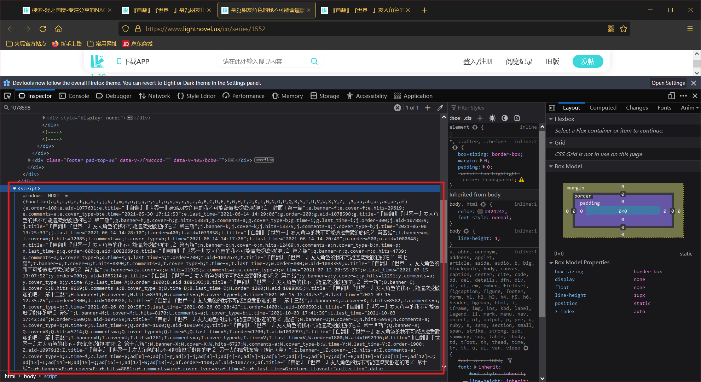

# lightnovel_epub

本工具用于基于[轻之国度](https://lightnovel.us)网页或 app 生成`epub`小说。

**注意：本工具仅作学习交流使用，作者不对内容和使用情况付任何责任！**

~~本来就是一个面向过程的小工具，怎么越发繁琐起来了。。。这里还要感慨一下LK牛逼的防御技术~~

# Requirements

* python 3.5 +
* click
* beautifulsoup4
* requests
* ebooklib
* uiautomator2
* dominate
* opencc
* opencv
* js2py

# `cli.py`

## 使用场景

针对可以在浏览器里阅读的文章。

* 2021/12/15 Update: 支持合集文章生成。
* 2021/12/15 Update: 支持 HTML 内嵌 base64 图片

## 原理

直接抓取 HTML，然后将其中的图片下载至本地，随后打包成 EPUB。

EPUB 内部目录：

```
.
├── Images               # 图片
│   ├── ...
│   └── ...
└── Text                 # 文本
    ├── about.xhtml      # 本项目自动生成
    └── lightnovel.xhtml # 轻小说正文
```

对于合集文章：

```
.
├── Images               # 图片
│   ├── ...
│   └── ...
└── Text                 # 文本
    ├── about.xhtml      # 本项目自动生成
    ├── Section1.xhtml   # P1
    ├── Section2.xhtml   # P2
    └── ...
```

此外，对于合集文章，解析的过程比较有趣，这里讨论一下。

首先是对 HTML 的分析。


很遗憾，并不是 `<a>` 也没有 `href`。去 `Source` 里一看，貌似框架选的是 `Vue`，不熟悉前端，不多做评价。

接着查看 `event`，发现是混淆过的 `js`，放弃逆向。


经观察，数据应该在文档最后的某个 `<script>` 标签内：



经过分析，这个 `<script>` 只暴露了一个接口：

```js
window.__NUXT__ = (function(...) { ... }) (...)
```

故我们只需要 evaluate 这个脚本，然后获取 `window.__NUXT__` 的值即可。

## 使用方法

下载命令：

```bash
python3 cli.py download <link> <path>
```

下面是我写的 `--help`:

```
$ python3 cli.py download --help
Usage: cli.py download [OPTIONS] URL

  download the light novel

  ARGUMENTS:
  * URL: url of light novel to download

Options:
  --dump-path PATH   directory for dumping
  --html-dump PATH   html content dump file path
  --title TEXT       title of light novel
  --authors TEXT     authors' names, separated by comma (,)
  --identifier TEXT  identifier of light novel
  --cover-link TEXT  cover_link of light novel. cover_link can either be web
                     link or file path. if it is not beginned with "http", it
                     would be recognized as file path. if nothing was given,
                     then it will use the first picture of webpage.
  --cvt TEXT         OpenCC conversion configuration, used to convert between
                     different Chinese characters. you can choose the value
                     from "s2t", "t2s", "s2tw", "tw2s", "s2hk", "hk2s",
                     "s2twp", "tw2sp", "t2tw", "hk2t", "t2hk", "t2jp", "jp2t",
                     "tw2t". if nothing is provided, no conversion would be
                     performed. for more information, please visit:
                     https://github.com/BYVoid/OpenCC
  --path PATH        directory for saving the light novel
  --help             Show this message and exit.
```

注意：命令的 `options` 可以直接忽略，因为执行命令后如果发现没有 `options` 会进行第二轮询问。

## Known Issues

* 对于部分 **先显示无权限观看**，**后可以观看** 的文章无效，以后可能会写浏览器模式

# `mobile.py`

请自行阅读代码使用。

5Zug5Li65LiA5Lqb5LiN5Y+v5piO6K+055qE5Y6f5Zug77yM6K+35p+l55yL5LiN5ZCM5YiG5pSv5ZKMY29tbWl06K6w5b2V77yMZW5qb3k=

# TODO

- [x] 图片下载至临时路径
- [ ] 用 PyQt 写 GUI
- [x] 为漫画提供更好的支持
- [ ] 增加更多 `metadata` : `tags`, `publisher`, ...
- [ ] 自动抓取标题
- [ ] 自动生成目录，~~如果网页上有 headers 的话~~
- [ ] 添加自定义 CSS / 字体 等支持
- [x] 简繁自动转换
- [x] 模拟轻国手机版
- [ ] 增加移动端截屏图片压缩选项

相关帖子：
* https://www.v2ex.com/t/800508
* https://www.lightnovel.us/cn/themereply/1088005
